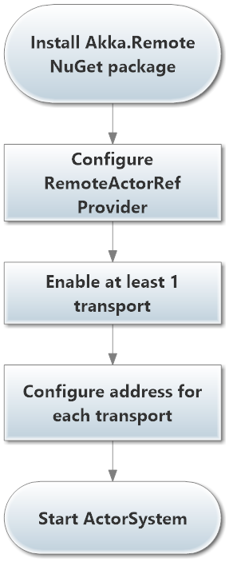
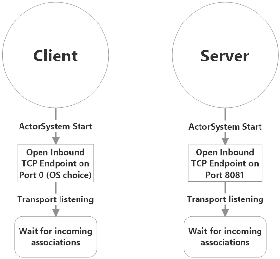
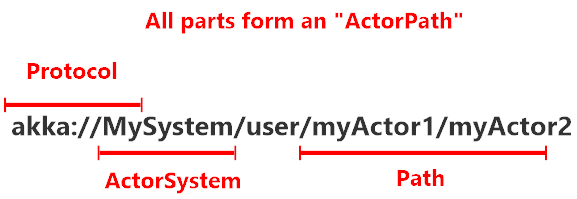
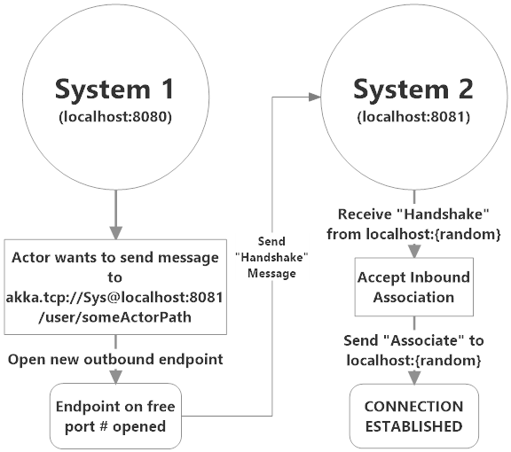

# Akka.Remote Overview
Akka.NET uses the "Home Depot" extensibility model - the base [Akka NuGet package](https://www.nuget.org/packages/Akka/) provides all of the capabilities you need to create actors, `IActorRef`s, and pass messages, but the Akka.NET project ships dozens of additional modules which take the capabilities of Akka.NET and extend them to do new things!

**[Akka.Remote](http://www.nuget.org/packages/Akka.Remote/) is the most powerful of all of these additional packages**, as it is what brings the capability to build an `ActorSystem` across multiple processes over a computer network.  

## Akka.Remote's Capabilities
Akka.Remote introduces the following capabilities to Akka.NET applications:

1. **Location transparency with RemoteActorRef** - write code that looks like it's communicating with local actors, but with just a few configuration settings your actors can begin communicating with actors hosted in remote processes in a way that's fully [location transparent](../concepts/location-transparency) to your code.
1. **Remote addressing** - Akka.Remote extends the `Address` and `ActorPath` components of Akka.NET to also now include information about how to connect to remote processes via `ActorSelection`.
1. **Remote messaging** - send messages, *transparently*, to actors running in remote `ActorSystem`s elsewhere on the network.
1. **Remote deployment** - remotely deploy actors via the `ActorOf` method onto remote `ActorSystem` instances, anywhere on the network! The location of your actors on the network becomes a deployment detail in Akka.Remote.
1. **Multiple network transports** - out of the box Akka.Remote ships with support for TCP, but has the ability to plugin third party transports and active multiple of them at the same time.

### Use Cases
Akka.Remote is most commonly used in distributed applications that run across the network, some examples include:

1. Client applications (WPF, Windows Forms) with duplex communication requirements with remote servers;
2. Server-to-Server applications;
3. Embedded Akka.NET applications; (like [this RaspberryPi example](https://twitter.com/AkkaDotNET/status/584109606714093568)!)
4. and any application that uses Akka.Cluster or any of its modules.

> NOTE: Akka.Remote largely serves as plumbing for Akka.Cluster and the other "high availability" modules within Akka.NET. The use cases for using Akka.Remote by itself are largely limited to scenarios that don't require the elasticity and fault-tolerance needs that Akka.Cluster fulfills.

That being said, it's a good idea to understand how Akka.Remote works if you intend to use clustering. So keep reading!

## Enabling Akka.Remote
Enabling Akka.Remote in your own applications is simple:



First you need to install the Akka.Remote NuGet package, which you can do like this:

	PS> Install-Package Akka.Remote

Next, you'll need to enable the `RemoteActorRefProvider` inside [HOCON configuration](../concepts/configuration) and bind your transport to an accessible IP address and port combination. Here's an example:

```xml
akka {
    actor {
        provider = "Akka.Remote.RemoteActorRefProvider, Akka.Remote"
    }

    remote {
        helios.tcp {
            port = 8080
            hostname = localhost
        }
    }
}
```

## Addresses, Transports, Endpoints, and Associations
In the above section we mentioned that you have to bind a *transport* to an IP address and port, we did in that in HOCON inside the `helios.tcp` section. Why did we have to do any of that?

Well, let's take a step back to define some key terms you'll need to be familiar with in order to use Akka.Remote:

- **Transport** - a "transport" refers to an actual network transport, such as TCP or UDP. By default Akka.Remote uses a [Helios](http://helios-io.github.io/ "Helios - Reactive socket middleware for .NET") TCP transport, but you could write your own transport and use that instead of you wish.
- **Address** - this refers to an IP address and port combination, just like any other IP-enabled protocol. You can also use a hostname instead of an IP address, but the hostname must be resolved to an IP address first. 
- **Endpoint** - an "endpoint" is a specific address binding for a transport. If I open a TCP transport at `localhost:8080` then I've created an *endpoint* for that transport at that address.
- **Association** - an "association" is a connection between two endpoints, each belonging to a different `ActorSystem`. Must have a valid *outbound* endpoint and a valid *inbound* endpoint in order to create the association.

> NOTE: Learn more about [Helios and the default Akka.Remote transports](../transports) here.

These terms form the basis for all remote interaction between `ActorSystem` instances, so they're critically important to learn and distinguish.

So in the case of our previous example, `localhost:8080` is the inbound (listening) endpoint for the Helios TCP transport of the `ActorSystem` we configured.

## How to Form Associations between Remote Systems
So imagine we have the following two actor systems configured to both use the `helios.tcp` Akka.Remote transport:

**Client**
```xml
akka {  
    actor {
        provider = "Akka.Remote.RemoteActorRefProvider, Akka.Remote"
    }
    remote {
        helios.tcp {
            port = 0 # bound to a dynamic port assigned by the OS
            hostname = localhost
        }
    }
}
```

**Server**
```xml
akka {  
    actor {
        provider = "Akka.Remote.RemoteActorRefProvider, Akka.Remote"
    }
    remote {
        helios.tcp {
            port = 8081 #bound to a specific port
            hostname = localhost
        }
    }
}
```

Here's what the initial state of those two systems would look like upon starting both `ActorSystem`s.



Both `ActorSystem` instances start, open their transports and bind them to the configured addresses (which creates an *inbound* endpoint for each) and then waits for incoming association attempts from elsewhere.

In order to actually form an association between the client and the server, *one of the nodes has to attempt contact with the other.* Remote associations are formed lazily!

### Addressing a Remote `ActorSystem`
In order to form an association with a remote `ActorSystem`, we have to have an [`Address`](http://api.getakka.net/docs/stable/html/58836154.htm) for that `ActorSystem`.

All local Akka.NET actors have an `Address` too, as part of their [`ActorPath`](http://api.getakka.net/docs/stable/html/6DC439AE.htm). 

**A local `ActorPath`** look like  this:



**A remote `ActorPath`** looks like this:


Each `ActorPath` consists of four parts:

1. **Protocol** - this defines the protocol used to communicate with this actor. Default local protocol is in-memory message passing.
2. **ActorSystem** - the name of the `ActorSystem` to which this actor belongs.
3. **Address** - refers to the inbound endpoint you can use to communicate with this actor via the protocol. There's a default address for local-only actors and it always get committed from local `ActorPaths`.
4. **Path** - refers to the path of this actor in the hierarchy.

When you want to connect to a remote `ActorSystem`, two important changes occur to the address:

1. **The protocol gets augmented with the protocol of the network transport** - so in this case, since we're using the Helios TCP transport the protocol for communicating with all remote actors in our `ActorSystem` changes from `akka://` to `akka.tcp://`. When you deploy an actor remotely or send a message to a remote actor via `ActorSelection`, specifying this protocol is what tells your local `ActorSystem` how to deliver this message to the remote one!
2. **The address gets populated with the inbound endpoint on the transport** - `localhost:9001` in this case. This lets your local system know how to attempt to establish an *outbound endpoint* to the remote `ActorSystem`.

> NOTE: for more information about addressing in Akka.NET, see [Actor References, Paths and Addresses](../concepts/addressing)

Here's how we actually use a remote `Address` to form an association between two remote `ActorSystem` instances.

### The Association Process
This information exposes some of the Akka.Remote internals to you, but it's important to know because without this information it's very difficult to troubleshoot association problems in production - *which you should anticipate as a product of imperfect networks*.



The association process begins when **System 1** has an actor who wants to send a message to an [`ActorSelection`](http://api.getakka.net/docs/stable/html/CC0731A6.htm) belonging to an actor who resides on **System 2**.

The `RemoteActorRefProvider` built into System 1, upon seeing the remote address in the `ActorSelection`, will check to see if a remote connection to System 2 is already open. Since there isn't one, it will open a new outbound endpoint using its TCP transport (which, internally, will create a new TCP socket on a new port - but that's beyond the scope of this course) and send an "handshake" message to System 2.

System 2 will receive the handshake, accept the inbound association, and reply with an "Associate" message which will complete the association process.

System 1 will then finally deliver the message contained in the `ActorSelection` to the appropriate actor on System 2.

That's how associations work in a nutshell!

#### Recap: Remote Deployments and Remote ActorSelections

#### Internals: How Akka.Remote Associations Work

We have a video that illustrates how this process works - this video was really designed for Akka.NET contributors who work on Akka.Remote, but there's a lot of benefit in understanding it as an end-user of Akka.NET too!

<iframe width="560" height="315" src="https://www.youtube.com/embed/6c1gVLyYcMM" frameborder="0" allowfullscreen></iframe>

## Additional Resources
* [Akka.NET Internals: How Akka.Remote Connections Work (Video)](https://www.youtube.com/watch?v=6c1gVLyYcMM)
* [ChatClient Akka.Remote example (Code Sample)](https://github.com/akkadotnet/akka.net/tree/dev/src/examples/Chat)